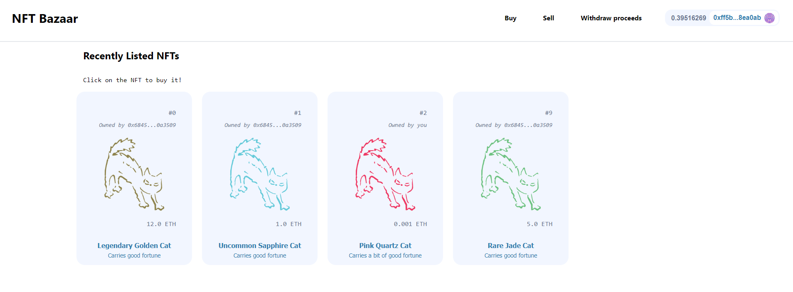
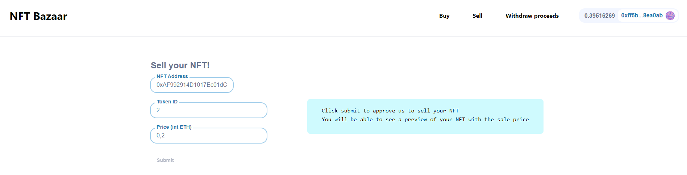
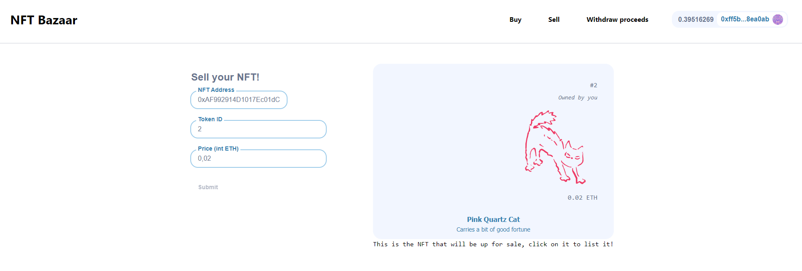
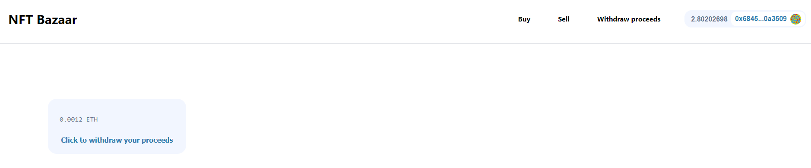

# NFT Bazaar:

##### NFT Bazaar is a Dapp that permits the user **buy** and **sell** NFT's through a smart contract deployed on the **Göerli testnet**.

**It has two pages:**

#### 1. Buy:

On this page the user can see recently listed NFT's, with NFT's image, description, name, current owner and the sale price.
The Dapp detects if the user is the owner of an NFT:

- In case the user isn't the owner, cliking on a NFT box would initialize a transaction with your provider to buy the NFT at the market price.
- In case the user is the owner, clicking on an NFT box would display a modal to change the sale price or cancel the listing.

#### 2. Sell:

On this page the user can put up for sale your NFT's.
To put for sale an NFT the user has to introduce the NFT contract address, the token ID the user owns and the desired sale price and click submit.
After approving the NFTMarket on the NFT's contract, the NFTMarket will create a listing preview to let the user confirm the sale details are correct.
Clicking on the preview will execute a transaction that will list the NFT on the market contract, and after block confirmation it will be displayed on the sell page.

#### 2. Withdraw proceeds:

The user can collect the proceeds from the NFT sales on this page. It displays the proceeds the user is elegible to collect, clicking the card will execute the withdraw function from the NFT Market contract.

### The Dapp is composed by three main components:

1. The **front end**, a Next.js app that performs queries to the NFTMarket contract and the specific ERC721 contracts that are listed on the Dapp.

2. The **smart contracts** that are uploaded on the Göerli testnet, which mainly manipulates the state of two mappings:

   - The `s_proceeds` mapping, which links **users** with their **balances to be withdrawn**.
   - The `s_listings` mapping, which links the **NFT token address** to the **token ID** to the **owner** and **sale price**.

   To manipulate the state the contract uses the functions `listItem`, `buyItem`, `cancelListing`, `updateListing` and `withdrawProceeds`.

3. The **subgraph** that indexes the events emitted when interacting with the NFTMarket and acts as an intermediary to keep track of the activeItems, which are the NFTs that are currently for sale. The front end performs API calls to request the activeItems from theGraph's subgraph, and displays them on the Home page.
